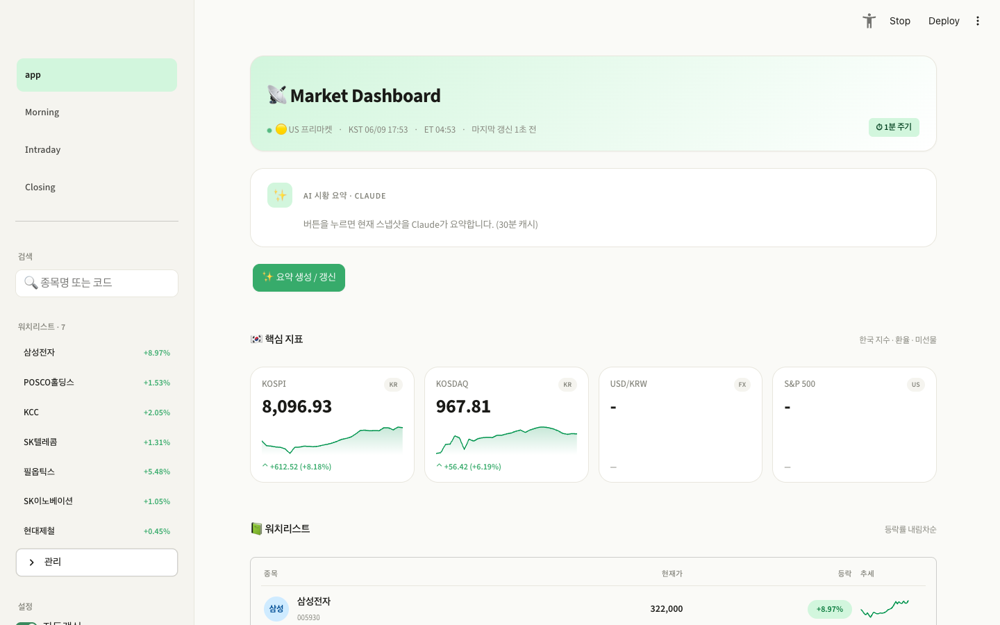
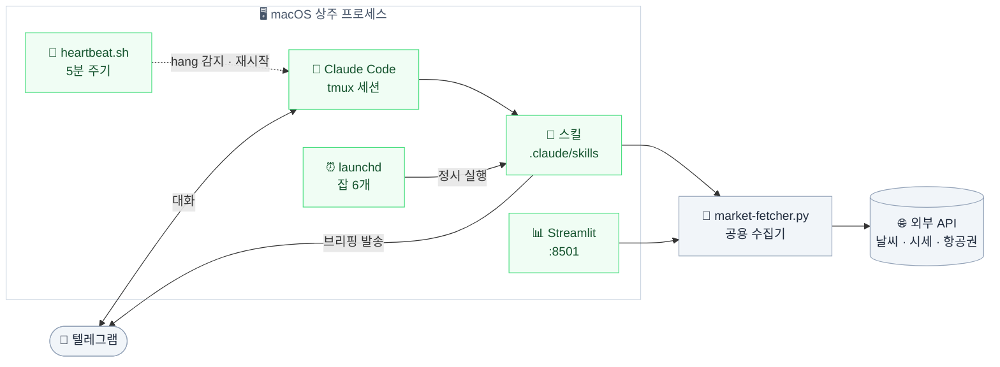
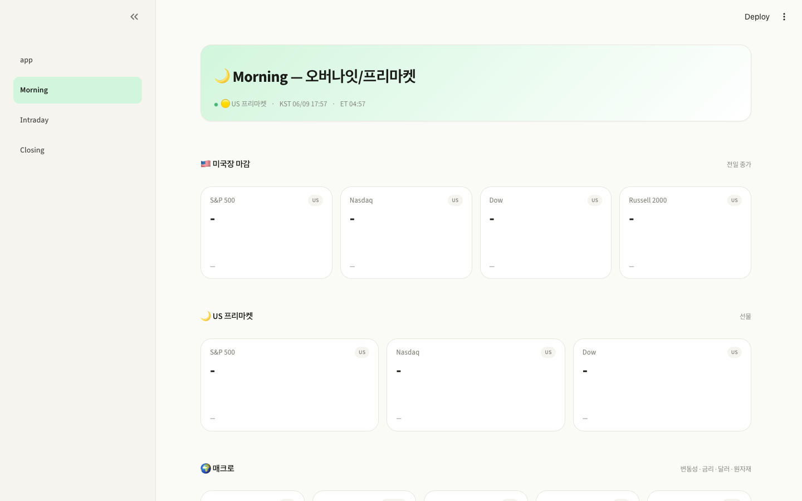
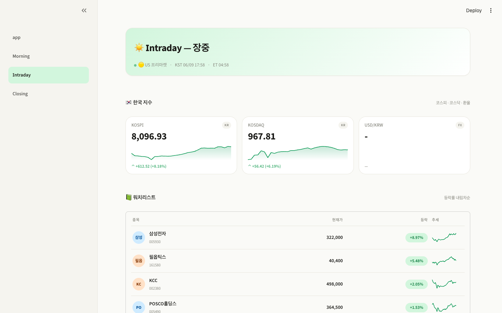
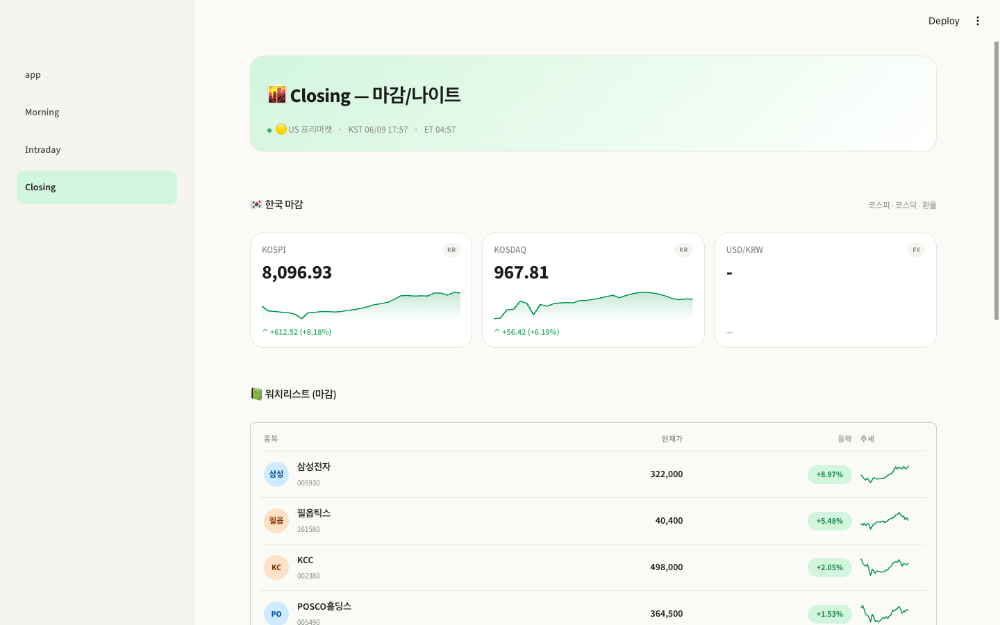
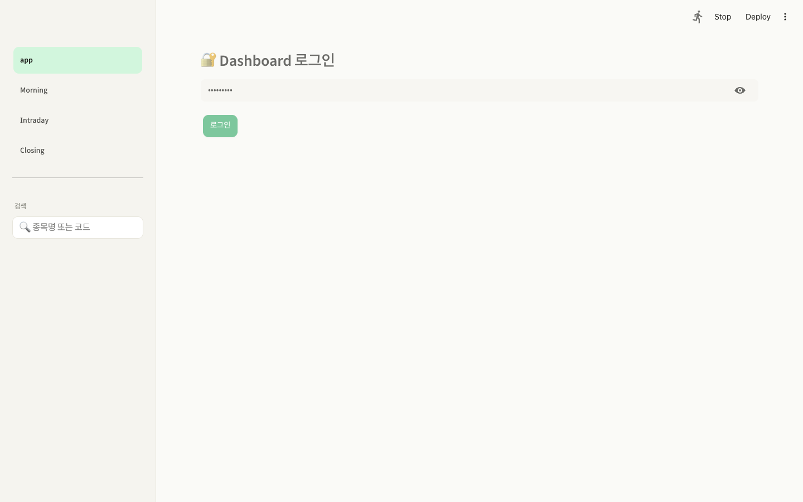

<div align="center">

# 🛰️ LMJAgent

**텔레그램으로 대화하는 macOS 상주 AI 비서**

Claude Code를 백그라운드 에이전트로 띄워두고, 정해진 시각에 날씨·주식 브리핑을 받아봅니다.<br/>
수집한 시장 데이터는 Streamlit 대시보드로도 확인할 수 있습니다.

<br/>


<br/>



</div>

<br/>

## ✨ 구성 요소

| | 구성 | 설명 |
|:--:|------|------|
| 🤖 | **상주 에이전트** | tmux 세션 안에서 Claude Code를 계속 띄워두고 텔레그램으로 대화. 죽으면 자동 재시작 |
| ⏰ | **정기 브리핑** | 날씨·주식 브리핑을 스킬로 생성해 정해진 시각에 텔레그램 발송 |
| 🧩 | **스킬** | 날씨·주식·항공권 조회 등 작업별 프롬프트 정의 (`.claude/skills/`) |
| 📊 | **대시보드** | 지수·매크로·섹터·워치리스트를 보여주는 Streamlit 앱 (포트 8501) |
| 💓 | **자가 복구** | 5분 주기 heartbeat로 hang을 감지하고 세션을 되살림 |

<br/>

## 🏗️ 아키텍처



<br/>

## ⏱️ 브리핑 스케줄

| 브리핑 | 아침 | 점심 | 저녁 | 요일 |
|--------|------|------|------|------|
| 🌤️ **날씨** | `08:00` | `12:00` | `18:00` | 매일 |
| 📈 **주식** | `07:30` | `12:30` | `17:30` | 평일 |

> 스케줄러로 cron 대신 **launchd**를 씁니다. cron은 GUI 세션 밖에서 실행되어 login keychain의
> Claude 자격증명을 읽지 못해 매번 실패합니다. 자세한 배경은 `scripts/launchd-install.sh` 헤더 참고.

<br/>

## 📸 대시보드

<table>
<tr>
<td width="50%"><br/><div align="center"><b>🌙 Morning</b> — 오버나잇 / 프리마켓</div></td>
<td width="50%"><br/><div align="center"><b>🌞 Intraday</b> — 장중 지수 / 워치리스트</div></td>
</tr>
<tr>
<td width="50%"><br/><div align="center"><b>🌆 Closing</b> — 마감 / 나이트</div></td>
<td width="50%"><br/><div align="center"><b>🔐 Login</b> — 외부 노출용 비밀번호 게이트</div></td>
</tr>
</table>

<br/>

## 📑 개발 결과 보고서

구성·운영·신뢰성을 정리한 16장 분량의 기술 보고서입니다.

<div align="center">
<a href="docs/LMJ-Agent-Report-v2.pdf"></a>
</div>

<div align="center">

📕 **[PDF 보기](docs/LMJ-Agent-Report-v2.pdf)** &nbsp;·&nbsp; 📙 **[PPTX 내려받기](docs/LMJ-Agent-Report-v2.pptx)**

</div>

> 보고서는 `scripts/build-report-ppt-v2.py` 로 생성합니다. 슬라이드 내용을 바꾸려면
> 스크립트를 수정한 뒤 다시 실행해 `docs/` 로 복사하세요.

<br/>

## 🚀 빠른 시작

### 요구 사항

- 🍎 macOS — launchd·키체인·tmux 기반이라 macOS 전용
- 🤖 [Claude Code](https://claude.com/claude-code) CLI (로그인된 상태)
- 🐍 `tmux`, Python 3.11+
- 📱 텔레그램 봇 토큰 ([@BotFather](https://t.me/BotFather))

### 설치

```bash
git clone <repo-url> ~/Repositories/Claude/LMJAgent
cd ~/Repositories/Claude/LMJAgent

# 1) 환경설정 — 봇 토큰과 수신자 chat_id 입력
cp config/env.sh.example config/env.sh
$EDITOR config/env.sh

# 2) 텔레그램 전송 확인
./scripts/tg-send.sh "설치 테스트"

# 3) 정기 브리핑 잡 등록 (launchd)
./scripts/launchd-install.sh

# 4) 상주 에이전트 시작
./scripts/agent-start.sh
```

<br/>

## 📖 사용법

<details open>
<summary><b>🤖 에이전트</b></summary>

```bash
./scripts/agent-start.sh     # LaunchAgent + heartbeat 로드
./scripts/agent-attach.sh    # tmux 세션 접속 (빠져나오기: Ctrl+b, d)
./scripts/agent-stop.sh      # 중지
tail -f logs/agent.log       # 로그
```

</details>

<details>
<summary><b>📨 브리핑 수동 실행</b></summary>

```bash
./scripts/weather-cron.sh morning     # morning | lunch | evening
./scripts/stock-cron.sh lunch

# launchd 잡을 직접 깨우기
launchctl kickstart -k gui/$(id -u)/com.ghyu.claude.stock.lunch
```

</details>

<details>
<summary><b>📊 대시보드</b></summary>

```bash
cp dashboard/.streamlit/secrets.toml.example dashboard/.streamlit/secrets.toml
$EDITOR dashboard/.streamlit/secrets.toml     # 접속 비밀번호 설정

# 런처가 프로젝트 내부 .venv 를 사용합니다
python3 -m venv .venv
.venv/bin/pip install -r dashboard/requirements.txt
./scripts/dashboard-start.sh                  # http://localhost:8501
./scripts/dashboard-stop.sh
```

`0.0.0.0`으로 바인딩되므로 Tailscale 등을 통해 폰에서도 접근할 수 있습니다.
외부 노출용 비밀번호 게이트(`dashboard/auth.py`)가 걸려 있으니 반드시 긴 랜덤 문자열로 바꾸세요.

```bash
openssl rand -base64 32
```

</details>

<br/>

## 🧩 스킬

`.claude/skills/` 에 정의되어 있고, 텔레그램에서 "아침 날씨 알려줘"처럼 말하거나
`claude -p "<스킬명> 스킬을 실행해줘"` 로 실행합니다.

| | 스킬 | 내용 |
|:--:|------|------|
| 🌤️ | `weather-morning` · `lunch` · `evening` | 시간대별 날씨 브리핑 |
| 📈 | `stock-morning` · `lunch` · `evening` | 프리마켓 / 장중 / 클로징 시장 브리핑 |
| 🔍 | `stock-analyze` | 종목 코드·티커별 단타(3~7일)·스윙(2~3주) 진입 분석 |
| ✈️ | `flight-check` | 네이버 항공권을 Playwright로 파싱해 최저가 조회 |
| 🔔 | `flight-watch` | 매진된 항공편을 감시하다 좌석이 열리면 알림 |

<br/>

## 📁 디렉토리 구조

```
.
├── 📄 CLAUDE.md                  # 에이전트 동작 지침 (Claude Code가 읽음)
├── 📂 config/
│   ├── env.sh                    # 텔레그램 토큰/수신자 (git 제외, .example 참고)
│   └── crontab.backup.*          # launchd 이전 전 crontab 백업
├── 📂 scripts/
│   ├── agent-launcher.sh         # tmux + Claude Code 기동, 헬스체크/재시작 루프
│   ├── agent-start|stop|attach.sh
│   ├── heartbeat.sh              # 5분 주기 hang 감지 및 복구
│   ├── check-login.sh            # 실행 전 Claude 로그인/토큰 상태 확인
│   ├── weather-cron.sh           # 날씨 브리핑 (morning|lunch|evening)
│   ├── stock-cron.sh             # 주식 브리핑 (morning|lunch|evening)
│   ├── tg-send.sh                # 텔레그램 전송 헬퍼
│   ├── launchd-install.sh        # 브리핑 6개 잡을 launchd에 등록
│   ├── sync.sh                   # 공용 저장소 서브디렉토리로 미러 동기화
│   ├── dashboard-*.sh            # 대시보드 기동/중지
│   └── build-report-ppt*.py      # 프로젝트 소개 리포트(PPT) 생성
├── 📂 dashboard/                 # Streamlit 앱 (app.py + pages/)
├── 📂 docs/screenshots/          # README용 스크린샷
└── 📂 .claude/
    ├── skills/                   # 스킬 정의 (SKILL.md)
    ├── shared-scripts/           # market-fetcher.py 등 데이터 수집 공용 스크립트
    └── settings.json             # 권한/훅 설정
```

<br/>

## 🔐 비밀정보 관리

> [!WARNING]
> 다음 파일들은 `.gitignore` 로 제외되어 있습니다. **절대 커밋하지 마세요.**

| 파일 | 내용 | 템플릿 |
|------|------|--------|
| `config/env.sh` | 텔레그램 봇 토큰, 수신자 chat_id | `config/env.sh.example` |
| `dashboard/.streamlit/secrets.toml` | 대시보드 접속 비밀번호 | `.example` 동봉 |
| `.claude/settings.local.json` | 로컬 권한 설정, API 키 | — |

API 키는 `.claude/settings.json`이 아니라 **`.claude/settings.local.json`** 에 둡니다.
전자는 git 추적 대상이라 커밋 시 그대로 노출됩니다.

<br/>

## 📐 개발 규칙

- 쉘 스크립트 수정 시 파일 상단 헤더의 `# 변경이력:` 에 `#   YYYY-MM-DD  변경 내용 요약` 한 줄을 추가합니다.
- 스크립트 헤더에는 **용도·사용법·동작 흐름**을 주석으로 남깁니다.
- 에이전트 동작 지침은 `CLAUDE.md` 에서 관리합니다.
